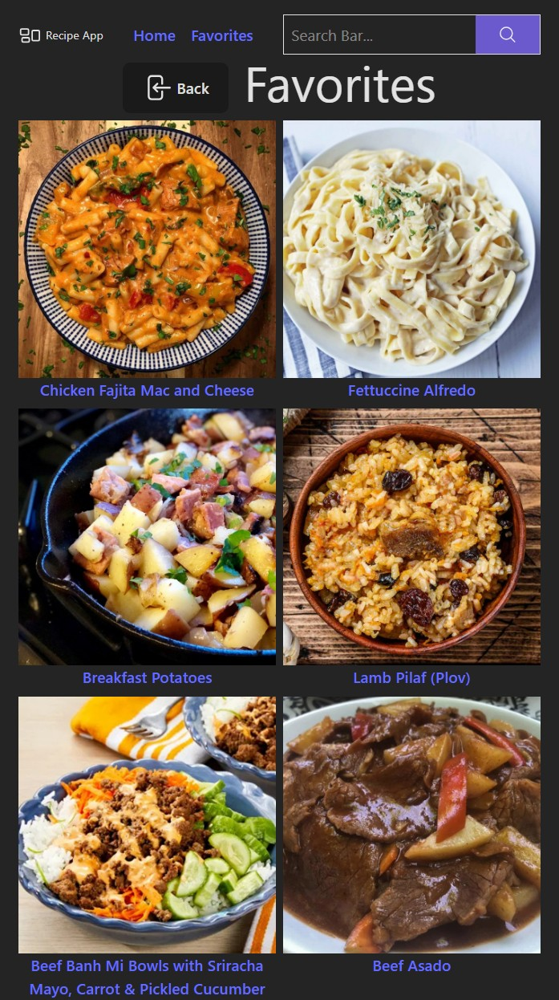

# Recipe Discovery App

This is a solution to the [Module 10 SBA: Recipe Discovery App](https://ps-lms.vercel.app/curriculum/se/416/sba). 

## Table of contents

- [Overview](#overview)
  - [The challenge](#the-challenge)
  - [Screenshot](#screenshot)
  - [Links](#links)
- [My process](#my-process)
  - [Built with](#built-with)
  - [What I learned](#what-i-learned)
  - [Reflections](#reflections)
  - [Continued development](#continued-development)
  - [Useful resources](#useful-resources)
- [Acknowledgments](#acknowledgments)

## Overview

For this project, you will build a ***client-side*** “Recipe Discovery” application. This project will serve as a comprehensive demonstration of your mastery of advanced React concepts. The application will allow users to **browse recipes by category**, **search for specific recipes**, **view detailed recipe information**, and **manage a personal list** of “favorite” recipes.

You will use a free, public API for recipe data and implement a varietys of hooks, state management patterns, and routing solutions to create a feature-rich, single-page application (SPA).

### The challenge

Project Planning
- [ ] Review requirements and define implementation strategy
- [ ] Outline components, state management, and TypeScript interfaces
- [ ] Plan form validation, state updates, and component communication

Component Planning
- [ ] Design component hierarchy and communication flow
- [ ] Plan filtering and sorting functionality


### Screenshot





### Links

- Solution URL: [GitHub: Recipe Discovery App](https://github.com/DblRH600/recipe-discovery-app)
- Live Site URL: []()

## My process

### Built with

- React
- Vite
- Tailwinds
- CSS custom properties
- Flexbox
- CSS Grid
- Mobile-first workflow

### What I learned

This SBA tested and demonstrated the process of using **custom hooks**, working with **useState** (State Management Properties), **useEffect**, **useContext** and **components**. This SBA aslo tested how to work with **React-Router** and **Pages**.

### Reflections

Developing the FavoritesContext for the app was challenging. Doing additional research on other state properties and use hooks like **useCallback** and how to properly implement them. The useCallback allows functions/features to be cached between re-renders and prevent unnecessary usage/re-creations of functions that are not in use. **useCallabck** was used to limit the function / re-renders of the **favorites** button unless actioned. **useCallback** manages the ***add***, ***remove***, ***isFavorites*** functionality as a means to improve usuability. 

The **useFetch** hook used **async** / **await** to promote usuability and allow other parts of the app to continue to render while waiting for the data to be fetched from the ***[TheMealDB](https://www.themealdb.com/) API***. **useFetch** also used a **try** / **catch** block to prevent the app from crashing if the fetch fails to retrieve information from the API, as well as check if the function / component is still mounted before allowing updates to the app / page.

Code Snippet:

```jsx FavoritesPage

function FavoritesPage() {
  const { favorites } = useFavorites();
  const [recipes, setRecipes] = useState([]);
  const [error, setError] = useState(null);

  useEffect(() => {
    const fetchFavs = async () => {
      try {
        const res = await Promise.all(
          favorites.map((id) =>
            fetch(`https://www.themealdb.com/api/json/v1/1/lookup.php?i=${id}`)
          )
        );

        const jsonData = await Promise.all(
          res.map((resp) => {
            if (!resp.ok) throw new Error("Failed to fetch recipe");
            return resp.json();
          })
        );

        const meals = jsonData.map((data) => data.meals?.[0]).filter(Boolean);
        setRecipes(meals);
      } catch (err) {
        console.error("Error fetching favorite recipes: ", err);
        setError("Failed to load favorites.");
      }
    };

    if (favorites.length > 0) {
      fetchFavs();
    } else {
      setRecipes([]); // clear if no favroites have been saved
    }

  }, [favorites]);

  if (error) return <p>{error}</p>;
  if (!favorites.length) return <p className="text-xl m-4 text-red-500">No Favorites Captured. Please Add Some!</p>

  return (
    <>
    <div className="flex justify-center items-center gap-4">
      <BackButton />
      <h1 className="mb-3">Favorites</h1>
    </div>
      

      <div className="grid grid-cols-2 gap-2">
        {recipes.map((meal) => (
          <Link key={meal.idMeal} to={`/recipe/${meal.idMeal}`}>
            
            <p>{meal.strMeal}</p>
          </Link>
        ))}
      </div>
    </>
  );
}

export default FavoritesPage;

```
```js useFetch Hook

function useFetch (url) {
  // define state & logic variables
  const [data, setData] = useState(null)
  const [loading, setLoading] = useState(true)
  const [error, setError] = useState(null)

  useEffect(() => {
    // to prevent setting the state after it is unmounted
    let isMounted = true

    const fetchData = async () => {
      setLoading(true)
      setError(null)

      try {
        const res = await fetch(url)
        if (!res.ok) {
          throw new Error(`HTTP error! status: ${res.status}`)
        }
        const json = await res.json()
        if (isMounted) {
          setData(json)
        }
      } catch (err) {
        if (isMounted) {
          setError(err.message || 'Something is wrong in the codebase')
        }
      } finally {
        if (isMounted) {
          setLoading(false)
        }
      }
    }

    fetchData()

    return () => {
      isMounted = false
    }
  }, [url])

  return { data, loading, error }
}

export default useFetch

```

### Continued development

I need to build futher understanding on where the **useState** hook should be placed and when to utilize ***props*** when passing functionality between parent and component connections. Understanding how to develop custom hooks was crucial to the productivity and reusability of the code blocks. This project also tested the ability to use context functions effectively.

### Useful resources

- [Documentation: React](https://react.dev/reference/react) - ***React.dev*** provides useful documentation and examples for how to use **useState** and **useCallback** hooks.

- [Documentation: tailwindcss](https://tailwindcss.com/docs/installation/using-vite) - ***tailwindscss*** was useful in helping to style the project.

- [Blog: How to use React Context effectively](https://kentcdodds.com/blog/how-to-use-react-context-effectively) - A blog by Kent Dodds on how to create and use React Context effectively

## Acknowledgments

I want express aprpeciation to Abraham Tavarez and Colton Wright for their help with understading how **useState** should be implemented in order for its use for each **component** impacted. 
